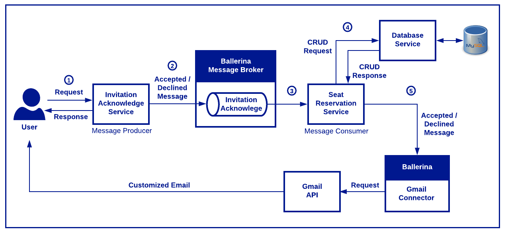
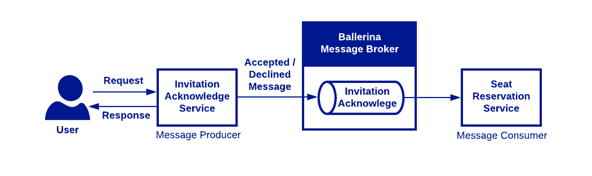
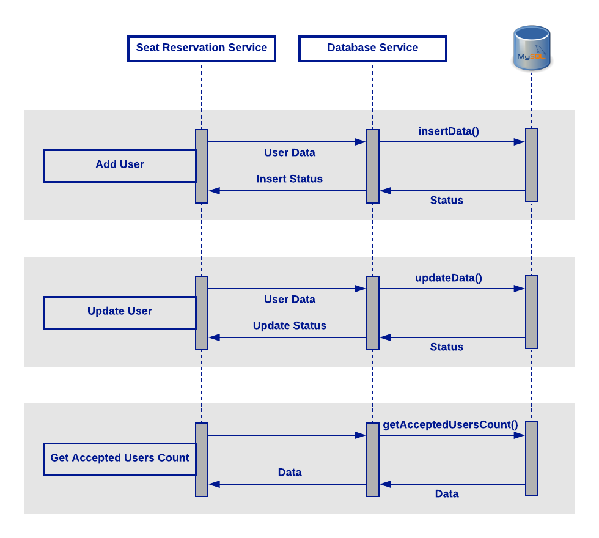
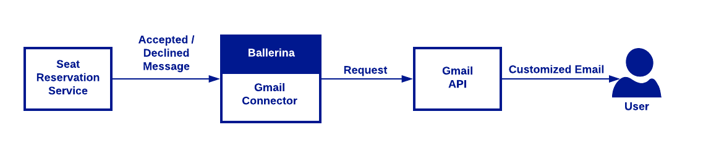

# Event Manager

Version: Ballerina 0.970.1

An article series is written to explain an end to end event management scenario from high level to a simplified way on how Ballerina and its features can be used to provide solution to an integration scenario.

Following are the articles on this scenario.

- [Integration with Ballerina-I - Introuction-Scenario](https://medium.com/@saad.sahibjan/integration-with-ballerina-i-1947295b340c)
- Integration with Ballerina-II - Use-case-1 - Working with Ballerina Message Broker
- Integration with Ballerina-III - Use-case-2 - Database Interaction
- Integration with Ballerina-IV - Use-case-3 - Working with Ballerina Gmail Connector

### High Level Diagram of Event Management Scenario

### Use-case-1 — Working with Ballerina Message Broker

### Use-case-2 — Database Interaction with Ballerina

### Use-case-3 — Sending Email through Ballerina Gmail Connector

